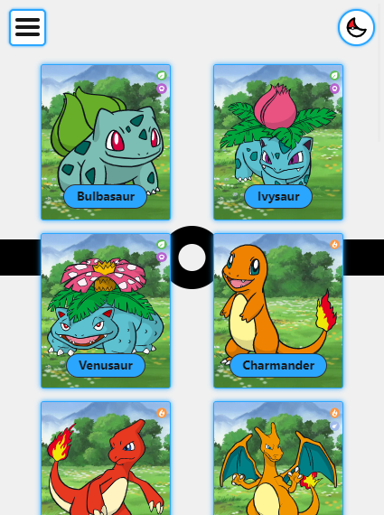
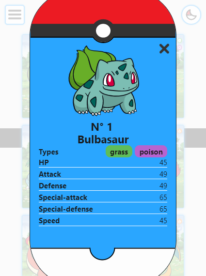
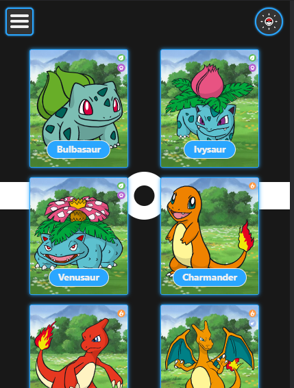
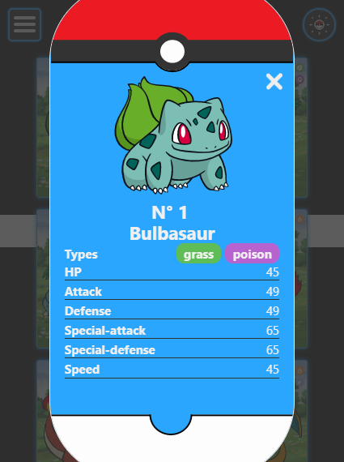
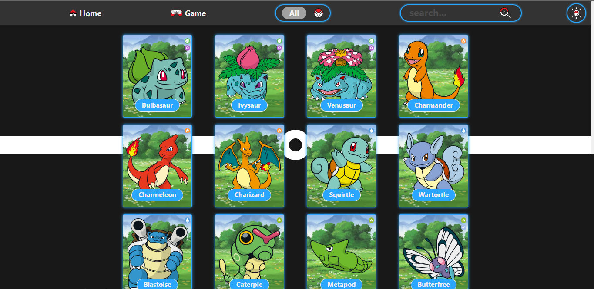
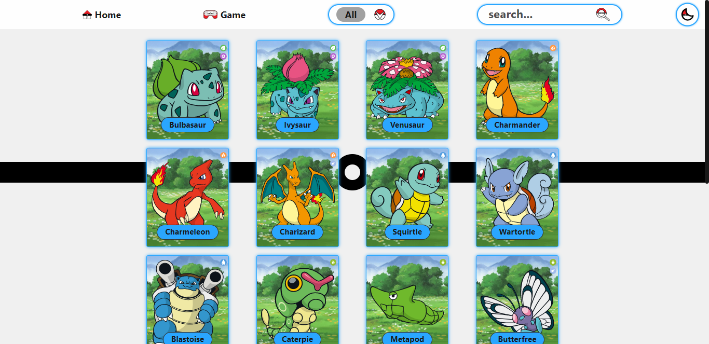
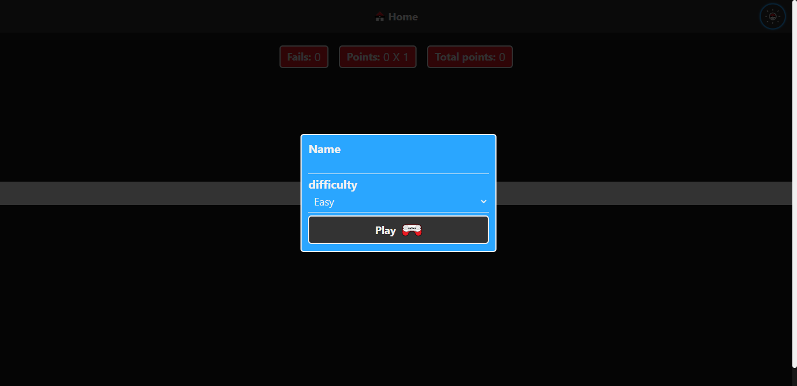
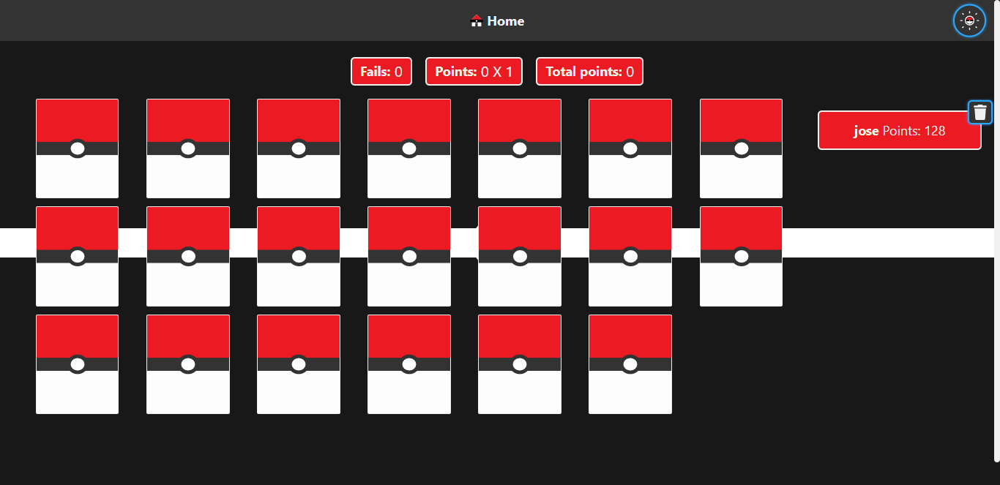

# [PokeApi](https://josefestevesp.github.io/pokeAPI/)

## Project description

this is a mini project that is about consuming the [pokeApi](https://pokeapi.co/), this project is made with the default technology, own design and icon 

technologies:
* HTML
* CSS
* javascript
---
## Mobile
### Light

### Pokedex

## Dark

### Pokedex

## DesKtop 
### Dark

### Light

### Filter

## Game

